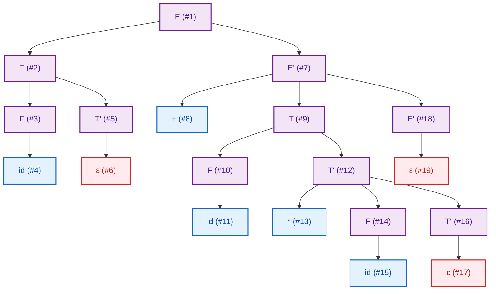

# Punto 5: Aplicación al Análisis Sintáctico Descendente
**Taller de Árboles, Recorridos y Complejidad Computacional**  
*Curso:* Lenguajes de Programación y Traducción — Universidad Sergio Arboleda  
*Entorno de ejecución:* Linux / WSL / Python 3.10+  

---

## Introduccion

Para resolver este ejercicio conectamos de manera directa los conceptos trabajados en los puntos previos del taller:
- **Punto 1:** Propiedades fundamentales de los árboles (raíz, hojas, nodos internos, grado, profundidad, altura).
- **Punto 2:** Jerarquía y evaluación de expresiones aritméticas.
- **Punto 3:** Recorridos en profundidad (**DFS**) y uso de la pila de ejecución.
- **Punto 4:** Recorridos en anchura (**BFS**) y exploración nivel por nivel mediante colas.

---

## Gramática y cadena de entrada

Trabajamos con la gramática estándar de expresiones aritméticas sin recursión izquierda (diseñada para analizadores predictivos descendentes LL(1)):

$$
\begin{aligned}
E  &\to T \; E' \\
E' &\to + \; T \; E' \;\mid\; \varepsilon \\
T  &\to F \; T' \\
T' &\to * \; F \; T' \;\mid\; \varepsilon \\
F  &\to (E) \;\mid\; id
\end{aligned}
$$

**Cadena a analizar:**
$$\mathbf{id + id * id}$$

Secuencia de tokens de entrada:
$$\langle \mathbf{id}_1, \; \mathbf{+}, \; \mathbf{id}_2, \; \mathbf{*}, \; \mathbf{id}_3, \; \mathbf{\$} \rangle$$
*(donde $\$$ representa el fin de la entrada o EOF)*.

---

## Representación gráfica del arbol sintáctico

A continuación se presenta el árbol sintáctico concreto (*Parse Tree*) generado para la expresión:



---

## Desarrollo paso a paso

### Actividad 1: Construcción paso a paso del árbol sintáctico por un analizador descendente

Un analizador sintáctico descendente (*top-down parser*) inicia siempre en el símbolo inicial de la gramática ($E$) e intenta derivar la cadena hacia las hojas, expandiendo en cada momento el **no terminal más a la izquierda** (*leftmost derivation*) guiado por el token que está mirando en la entrada (*lookahead*).

La traza de derivación y construcción ocurre en los siguientes 18 pasos:

1. **Inicio en $E$:** Se crea la raíz con el símbolo no terminal $E$. El lookahead actual es `id`.
2. **Expansión de $E$:** Con lookahead `id`, la tabla predictiva indica aplicar $E \to T E'$. Se crean los hijos $T$ y $E'$.
3. **Expansión de $T$ (hijo izquierdo de $E$):** Con lookahead `id`, se aplica la producción $T \to F T'$. Se crean los hijos $F$ y $T'$.
4. **Expansión de $F$ (hijo izquierdo de $T$):** Con lookahead `id`, se aplica la regla $F \to id$. Se crea el nodo no terminal $F$ y su hijo terminal `id`.
5. **Match del primer `id`:** El analizador verifica que el token actual coincide con `id`. Se consume `id_1` y el apuntador de entrada avanza al siguiente token: `+`.
6. **Expansión de $T'$ (hijo derecho de $T$):** El lookahead actual es `+`. En la tabla LL(1), como $+ \in \text{Follow}(T')$, se aplica la producción vacía $T' \to \varepsilon$. Se crea la hoja $\varepsilon$. La subexpresión izquierda del término $T$ queda completada.
7. **Expansión de $E'$ (hijo derecho de $E$):** El lookahead actual es `+`. La tabla indica la regla $E' \to + T E'$. Se crean tres ramas: el terminal `+`, el no terminal $T$ y el nuevo no terminal $E'$.
8. **Match del operador `+`:** Se empareja y consume el token `+`. El lookahead avanza a `id`.
9. **Expansión del segundo $T$:** Con lookahead `id`, se aplica nuevamente $T \to F T'$. Se crean sus hijos $F$ y $T'$.
10. **Expansión de $F$:** Con lookahead `id`, se aplica $F \to id$. Se crea el hijo `id`.
11. **Match del segundo `id`:** Se consume `id_2`. El lookahead avanza a `*`.
12. **Expansión de $T'$:** Con lookahead `*`, la regla a aplicar es $T' \to * F T'$. Se crean tres hijos bajo $T'$: el terminal `*`, el no terminal $F$ y un nuevo $T'$.
13. **Match del operador `*`:** Se empareja y consume el token `*`. El lookahead avanza a `id`.
14. **Expansión de $F$:** Con lookahead `id`, se aplica $F \to id$.
15. **Match del tercer `id`:** Se consume `id_3`. El lookahead avanza a fin de cadena (`$`).
16. **Expansión del tercer $T'$:** Con lookahead `$`, dado que $\$ \in \text{Follow}(T')$, se aplica $T' \to \varepsilon$. Se crea la hoja $\varepsilon$.
17. **Expansión del segundo $E'$:** Con lookahead `$`, dado que $\$ \in \text{Follow}(E')$, se aplica $E' \to \varepsilon$. Se crea la hoja $\varepsilon$.
18. **Finalización:** La entrada se ha consumido por completo (`$`), la pila de llamadas retorna con éxito a la raíz $E$. ¡Cadena sintácticamente válida!

---

### Actividad 2: Numeración de los nodos en el orden en que son creados

En un analizador descendente recursivo en Python (o C/Java), cada función asociada a un no terminal instancia su propio nodo inmediatamente al comenzar su ejecución, y crea a sus hijos de izquierda a derecha al llamar recursivamente a los submétodos o al hacer `match()` de los terminales.

El orden cronológico exacto de instanciación de los **19 nodos** es:

| # Nodo | Símbolo | Tipo de Nodo | Padre | Justificación de Creación |
| :---: | :---: | :---: | :---: | :--- |
| **1** | $E$ | No Terminal | *(Raíz)* | Instanciado al iniciar `parse_E()` |
| **2** | $T$ | No Terminal | $E$ (#1) | Primer hijo instanciado al ejecutar $E \to T E'$ |
| **3** | $F$ | No Terminal | $T$ (#2) | Primer hijo instanciado al ejecutar $T \to F T'$ |
| **4** | `id` | Terminal | $F$ (#3) | Hoja creada al hacer match del primer token `id` |
| **5** | $T'$ | No Terminal | $T$ (#2) | Segundo hijo instanciado por `parse_T()` |
| **6** | $\varepsilon$ | Producción Vacía | $T'$ (#5) | Hoja creada al aplicar $T' \to \varepsilon$ ante lookahead `+` |
| **7** | $E'$ | No Terminal | $E$ (#1) | Segundo hijo instanciado por `parse_E()` |
| **8** | `+` | Terminal | $E'$ (#7) | Primer hijo de $E'$, creado al hacer match de `+` |
| **9** | $T$ | No Terminal | $E'$ (#7) | Segundo hijo de $E'$, instanciado por $E' \to + T E'$ |
| **10** | $F$ | No Terminal | $T$ (#9) | Primer hijo del segundo $T$, al ejecutar $T \to F T'$ |
| **11** | `id` | Terminal | $F$ (#10) | Hoja creada al hacer match del segundo token `id` |
| **12** | $T'$ | No Terminal | $T$ (#9) | Segundo hijo del segundo $T$ |
| **13** | `*` | Terminal | $T'$ (#12) | Primer hijo de $T'$, creado al hacer match de `*` |
| **14** | $F$ | No Terminal | $T'$ (#12) | Segundo hijo de $T'$, al ejecutar $T' \to * F T'$ |
| **15** | `id` | Terminal | $F$ (#14) | Hoja creada al hacer match del tercer token `id` |
| **16** | $T'$ | No Terminal | $T'$ (#12) | Tercer hijo de $T'$, al ejecutar $T' \to * F T'$ |
| **17** | $\varepsilon$ | Producción Vacía | $T'$ (#16) | Hoja creada al aplicar $T' \to \varepsilon$ ante lookahead `$` |
| **18** | $E'$ | No Terminal | $E'$ (#7) | Tercer hijo del primer $E'$, al ejecutar $E' \to + T E'$ |
| **19** | $\varepsilon$ | Producción Vacía | $E'$ (#18) | Hoja creada al aplicar $E' \to \varepsilon$ ante lookahead `$` |

---

### Actividad 3: Recorridos sobre el árbol (DFS Preorden, DFS Postorden y BFS)

#### 1. DFS en Preorden (Raíz $\to$ Subárboles de izquierda a derecha)
Secuencia de visita:
$$\mathbf{E_{(1)} \to T_{(2)} \to F_{(3)} \to id_{(4)} \to T'_{(5)} \to \varepsilon_{(6)} \to E'_{(7)} \to +_{(8)} \to T_{(9)} \to F_{(10)} \to id_{(11)} \to T'_{(12)} \to *_{(13)} \to F_{(14)} \to id_{(15)} \to T'_{(16)} \to \varepsilon_{(17)} \to E'_{(18)} \to \varepsilon_{(19)}}$$

#### 2. DFS en Postorden (Subárboles de izquierda a derecha $\to$ Raíz)
Secuencia de visita:
$$\mathbf{id_{(4)} \to F_{(3)} \to \varepsilon_{(6)} \to T'_{(5)} \to T_{(2)} \to +_{(8)} \to id_{(11)} \to F_{(10)} \to *_{(13)} \to id_{(15)} \to F_{(14)} \to \varepsilon_{(17)} \to T'_{(16)} \to T'_{(12)} \to T_{(9)} \to \varepsilon_{(19)} \to E'_{(18)} \to E'_{(7)} \to E_{(1)}}$$

#### 3. BFS (Recorrido en Anchura — Nivel por Nivel utilizando una Cola)
Distribución por niveles:
- **Nivel 0:** $E_{(1)}$
- **Nivel 1:** $T_{(2)}, \; E'_{(7)}$
- **Nivel 2:** $F_{(3)}, \; T'_{(5)}, \; +_{(8)}, \; T_{(9)}, \; E'_{(18)}$
- **Nivel 3:** $id_{(4)}, \; \varepsilon_{(6)}, \; F_{(10)}, \; T'_{(12)}, \; \varepsilon_{(19)}$
- **Nivel 4:** $id_{(11)}, \; *_{(13)}, \; F_{(14)}, \; T'_{(16)}$
- **Nivel 5:** $id_{(15)}, \; \varepsilon_{(17)}$

Secuencia completa BFS:
$$\mathbf{E_{(1)} \to T_{(2)} \to E'_{(7)} \to F_{(3)} \to T'_{(5)} \to +_{(8)} \to T_{(9)} \to E'_{(18)} \to id_{(4)} \to \varepsilon_{(6)} \to F_{(10)} \to T'_{(12)} \to \varepsilon_{(19)} \to id_{(11)} \to *_{(13)} \to F_{(14)} \to T'_{(16)} \to id_{(15)} \to \varepsilon_{(17)}}$$

---

### Actividad 4: Que información proporciona cada recorrido?

1. **DFS en Preorden:**
   - **Información estructural y generativa:** Proporciona el orden cronológico en el que el compilador descubre y predice las estructuras sintácticas a partir de la gramática.
   - **Correspondencia directa:** Coincide exactamente con la **derivación más a la izquierda** (*leftmost derivation*).
   - **Uso en compiladores:** Es fundamental para propagar **atributos heredados** (*inherited attributes*), como pasar el tipo de dato de una declaración hacia las variables hijas, o comunicar tablas de símbolos desde un ámbito superior (*scope*) hacia los bloques internos.

2. **DFS en Postorden:**
   - **Información de resolución y síntesis:** Garantiza que los hijos (operandos y subexpresiones) se visiten y resuelvan **antes** que sus nodos padres.
   - **Correspondencia con evaluación:** Es la base para la evaluación de expresiones y el cálculo de **atributos sintetizados** (*synthesized attributes*). En un árbol de sintaxis abstracta (AST) o en un compilador con generación de código, el postorden indica cuándo emitir las instrucciones de la máquina (por ejemplo, generar primero las cargas de los operandos y luego la instrucción de suma o multiplicación).
   - **Relación con analizadores ascendentes:** Equivale al orden exacto en el que un analizador ascendente (*Bottom-Up* / LR / Shift-Reduce como Bison o Yacc) realiza las **reducciones**.

3. **BFS (Anchura por Niveles):**
   - **Información topológica y jerárquica:** Muestra la distancia uniforme de cada componente respecto a la raíz del programa.
   - **Frontera sintáctica:** Permite inspeccionar el árbol capa por capa.
   - **Uso en optimización y diagnóstico:** Es de gran utilidad para algoritmos de recuperación de errores sintácticos (*error recovery*) que buscan la reparación sintáctica de menor costo o el ancestro común más cercano sin profundizar indefinidamente en ramas recursivas.

---

### Actividad 5: Comparación entre el orden de creación de los nodos y el recorrido en preorden

Al observar detenidamente los resultados de la Actividad 2 y la Actividad 3:
- **Orden de creación:** $1, 2, 3, 4, 5, 6, 7, 8, 9, 10, 11, 12, 13, 14, 15, 16, 17, 18, 19$.
- **Recorrido Preorden:** Nodo #1 $\to$ Nodo #2 $\to$ Nodo #3 $\to \dots \to$ Nodo #19.

¡La coincidencia es **100% idéntica**!

**Explicación teórica:**
Un analizador sintáctico descendente (*top-down parser*) opera bajo el paradigma de descomposición recursiva. Cuando el analizador entra a una regla (por ejemplo, `parse_E()`), **primero** crea el nodo correspondiente al lado izquierdo de la producción (el padre) y **después** realiza llamadas recursivas a sus hijos de izquierda a derecha. 

Dado que la pila del sistema operativo (*call stack*) apila la llamada del padre antes de proceder con sus hijos, la estrategia de instanciación del analizador sintáctico descendente implementa, por definición arquitectónica, un **recorrido DFS en Preorden**.

---

### Actividad 6: Representación de la precedencia del operador $*$ sobre el operador $+$

En el diseño de lenguajes y compiladores (tal como explica el *Dragon Book*), la precedencia de operadores se codifica directamente en la **estratificación de la gramática**:
1. Los operadores de **menor precedencia** (como la suma $+$) se definen en las producciones más cercanas al símbolo inicial ($E \to T E'$).
2. Los operadores de **mayor precedencia** (como el producto $*$) se definen en niveles más profundos ($T \to F T'$, $T' \to * F T'$).

Al observar el árbol sintáctico generado:
- El operador de suma `+` se encuentra en el **Nivel 2** (hijo de $E'$ en el nivel 1).
- El operador de multiplicación `*` se encuentra en el **Nivel 4** (hijo de $T'$ en el nivel 3, el cual desciende de $T$ en el nivel 2).

**¿Cómo garantiza esto la precedencia durante la ejecución?**
Cuando se realiza la evaluación semántica (la cual se ejecuta en **postorden** o de abajo hacia arriba):
1. El subárbol enraizado en el segundo $T$ agrupa completamente a `id * id` mediante la subderivación $T \Rightarrow F T' \Rightarrow id * F T' \Rightarrow id * id$.
2. Para que el nodo $T$ (Nivel 2) pueda entregar su valor al nodo $E'$ (donde está la suma `+`), es obligatorio evaluar primero todo su subárbol interior, ejecutando primero la multiplicación.
3. El resultado de dicha multiplicación es lo que finalmente se suma con el primer `id`.

Por lo tanto: **a mayor precedencia de un operador, mayor es su profundidad en el árbol sintáctico**, obligando a su resolución previa.

---

### Actividad 7: Algoritmo para métricas del árbol sintáctico

A continuación se propone el algoritmo en pseudocódigo y su implementación en Python, el cual realiza un recorrido recursivo en profundidad visitando cada nodo una vez (complejidad óptima $O(N)$):

#### Pseudocódigo
```text
Algoritmo AnalizarArbolSintactico(nodo):
    Si nodo es Nulo:
        Retornar { terminales: 0, no_terminales: 0, epsilons: 0, altura: -1 }

    Si nodo.es_produccion_vacia_epsilon():
        Retornar { terminales: 0, no_terminales: 0, epsilons: 1, altura: 0 }

    Si nodo.es_hoja_terminal():
        Retornar { terminales: 1, no_terminales: 0, epsilons: 0, altura: 0 }

    // El nodo es un No Terminal
    total_terminales = 0
    total_no_terminales = 1   // Se cuenta el nodo actual
    total_epsilons = 0
    max_altura_hijos = -1

    Para cada hijo en nodo.hijos:
        res_hijo = AnalizarArbolSintactico(hijo)
        total_terminales = total_terminales + res_hijo.terminales
        total_no_terminales = total_no_terminales + res_hijo.no_terminales
        total_epsilons = total_epsilons + res_hijo.epsilons
        Si res_hijo.altura > max_altura_hijos:
            max_altura_hijos = res_hijo.altura

    altura_actual = max_altura_hijos + 1

    Retornar {
        terminales: total_terminales,
        no_terminales: total_no_terminales,
        epsilons: total_epsilons,
        altura: altura_actual
    }
```

#### Resultados obtenidos sobre nuestro árbol sintáctico:
- **Total de nodos en el árbol:** $19$
- **Nodos no terminales:** $11$ ($E, T, F, T', E', T, F, T', F, T', E'$)
- **Nodos terminales:** $5$ (`id`, `+`, `id`, `*`, `id`)
- **Producciones vacías $\varepsilon$:** $3$
- **Altura del árbol en aristas:** $5$ *(camino más largo: $E \to E' \to T \to T' \to F \to id$)*
- **Niveles totales de nodos:** $6$ *(niveles del 0 al 5)*

---

## Comparación Final: DFS vs. BFS

Diligenciamiento de la tabla comparativa solicitada en la página 6 del taller:

| Criterio | Recorrido en Profundidad (DFS) | Recorrido en Anchura (BFS) |
| :--- | :--- | :--- |
| **Estructura auxiliar** | Pila (*Stack* LIFO) o Pila de llamadas del sistema (*Call Stack*). | Cola (*Queue* FIFO). |
| **Orden de exploración** | Desciende rama por rama hacia las hojas antes de retroceder (*backtracking*). | Explora horizontalmente nivel por nivel de forma secuencial. |
| **Complejidad temporal** | $\mathcal{O}(V + E) = \mathcal{O}(N)$, visita cada nodo una vez. | $\mathcal{O}(V + E) = \mathcal{O}(N)$, visita cada nodo una vez. |
| **Complejidad espacial** | $\mathcal{O}(h)$, donde $h$ es la altura del árbol (profundidad máxima). | $\mathcal{O}(w)$, donde $w$ es el ancho máximo del árbol (nodos del nivel más poblado). |
| **Conveniente para evaluar expresiones** | **Altamente conveniente** (especialmente en Postorden, garantiza operandos resueltos). | **Inconveniente** (los operandos y operadores están en niveles disjuntos). |
| **Conveniente para recorrer por niveles** | **Inconveniente** (requiere simulación o arreglos auxiliares por profundidad). | **Ideal y natural** (visita los nodos exactamente ordenados por su distancia a la raíz). |
| **Comportamiento en árboles profundos** | Riesgo de desbordamiento de pila (*Stack Overflow*) si $h \to N$ en árboles degenerados. | Seguro respecto a la profundidad; la memoria depende de la dispersión de hijos por nivel. |
| **Comportamiento en árboles anchos** | Muy eficiente en memoria, pues solo almacena la rama actual en exploración. | Alto consumo de memoria ($\mathcal{O}(b^d)$), la cola retiene todos los nodos del nivel más ancho. |

---

## Conclusión Final (150 a 200 palabras)

> **¿Por qué los árboles y sus recorridos son fundamentales para implementar un analizador sintáctico descendente?**
>
> Los árboles y sus recorridos constituyen la columna vertebral del análisis sintáctico descendente porque materializan la estructura jerárquica implícita en las gramáticas libres de contexto. Mientras que el código fuente es una secuencia unidimensional de caracteres, el árbol sintáctico revela las relaciones de anidamiento, ámbito y precedencia que gobiernan el lenguaje. En este esquema, el analizador predictivo opera descubriendo y construyendo los nodos en un recorrido en profundidad (*DFS preorden*), guiado por la pila de recursión y los símbolos de anticipación. Posteriormente, la fase de traducción y comprobación semántica se apoya en recorridos en *postorden* para sintetizar tipos, evaluar expresiones y generar código intermedio únicamente cuando los subárboles de los operandos han sido resueltos. Por su parte, el recorrido en anchura (*BFS*) permite auditar la frontera de derivación y facilita estrategias óptimas de recuperación ante errores. En conclusión, sin la abstracción del árbol y la disciplina de sus recorridos, resultaría imposible transformar texto plano en un modelo computacional estructurado, validado y ejecutable.

---

## Guía de Ejecución en Linux y WSL

El código está desarrollado en Python estándar y solo requiere `matplotlib` para la generación de las figuras vectoriales y de alta resolución.

### 1. Clonar el repositorio y entrar a la carpeta
```bash
git clone <URL_DE_TU_REPOSITORIO>
cd punto5sintactico
```

### 2. Crear y activar entorno virtual (Recomendado)
En cualquier distribución de Linux (Ubuntu, Debian, Fedora, Arch) o en WSL:
```bash
python3 -m venv venv
source venv/bin/activate
```

### 3. Instalar dependencias
```bash
pip install matplotlib pillow
```

### 4. Ejecutar el script
```bash
python3 punto5.py
```

### 5. Salida esperada
Al ejecutar el comando verás en consola:
- La traza paso a paso del parser predictivo con las reglas aplicadas y los tokens consumidos.
- El árbol sintáctico impreso jerárquicamente en formato ASCII.
- Las secuencias completas de los tres recorridos (**DFS Preorden**, **DFS Postorden**, **BFS**).
- El reporte de métricas computadas (terminales, no terminales, $\varepsilon$, altura).
- La generación automática de los diagramas:
  - `arbol_sintactico.png` y `arbol_sintactico.svg`
  - `arbol_sintactico_numerado.png` y `arbol_sintactico_numerado.svg`
